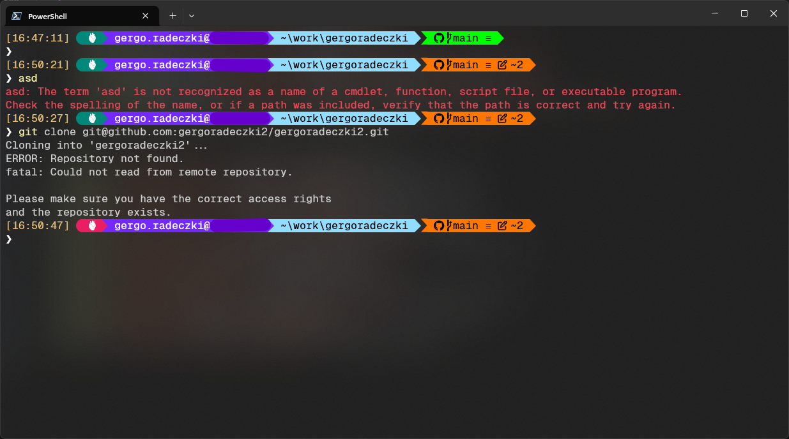

# PowerShell and Oh My Posh config files



## Installing PowerShell

```ps
winget install --id Microsoft.PowerShell
```

## Installing Oh My Posh

```ps
winget install --id JanDeDobbeleer.OhMyPosh
```
