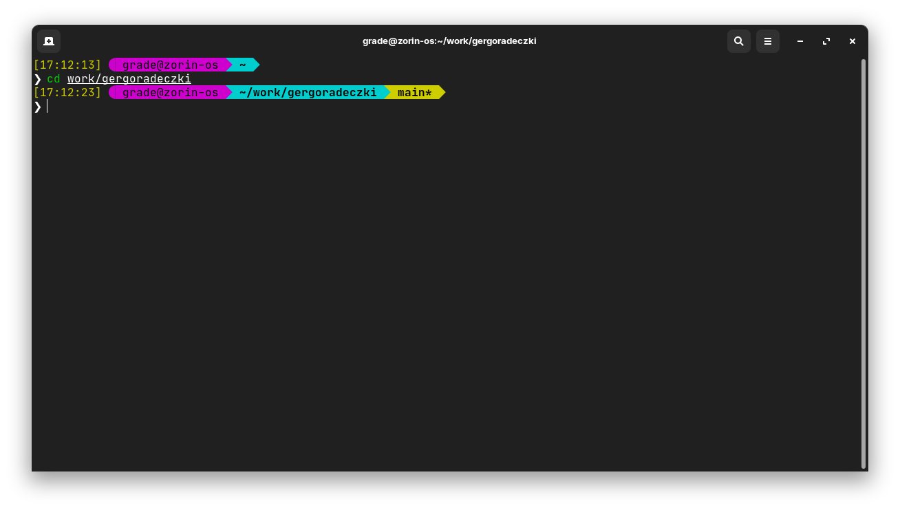

# Zsh and Oh My Zsh config files



## Installing Zsh

```bash
sudo apt update
sudo apt install zsh
```

### Settings Zsh as default shell

```bash
chsh -s $(which zsh)
```

## Installing Oh My Zsh

Source: [website](https://ohmyz.sh/)

```bash
# CURL
sh -c "$(curl -fsSL https://raw.github.com/ohmyzsh/ohmyzsh/master/tools/install.sh)"

# WGET
sh -c "$(wget https://raw.github.com/ohmyzsh/ohmyzsh/master/tools/install.sh -O -)"
```
